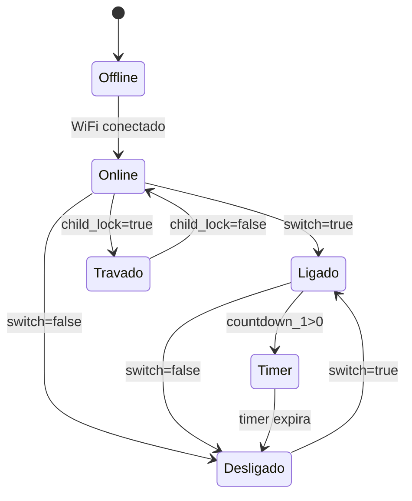
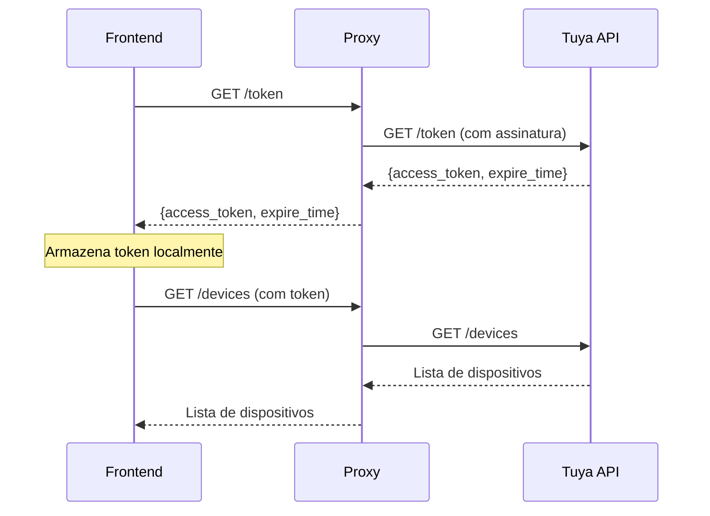

# ⚙️ Especificações Técnicas - Sistema Tongou

## 📋 Visão Geral Técnica

O Sistema Tongou é uma solução web completa para controle IoT de disjuntores inteligentes, desenvolvida com foco em simplicidade, segurança e escalabilidade para o setor hoteleiro.

---

## 🏗️ Arquitetura do Sistema

### Diagrama de Componentes
```
┌─────────────────┐    ┌──────────────────┐    ┌─────────────────┐
│   Frontend      │◄──►│  CORS Proxy      │◄──►│   Tuya Cloud    │
│   (HTML/JS)     │    │ (Cloudflare)     │    │      API        │
└─────────────────┘    └──────────────────┘    └─────────────────┘
         │                                               │
         ▼                                               ▼
┌─────────────────┐                            ┌─────────────────┐
│  Gemini AI      │                            │  SY1 WiFi       │
│     API         │                            │   Switch        │
└─────────────────┘                            └─────────────────┘
```

### Stack Tecnológico

#### Frontend
- **HTML5**: Estrutura semântica e responsiva
- **CSS3**: Styling moderno com Flexbox/Grid
- **JavaScript ES6+**: Lógica de aplicação
- **Web APIs**: LocalStorage, Fetch, Crypto

#### Backend/Proxy
- **Cloudflare Workers**: Edge computing para CORS
- **Web Standards**: Service Workers compliance

#### APIs Externas
- **Tuya Cloud API**: Comunicação IoT
- **Google Gemini**: Análise por IA
- **HMAC-SHA256**: Autenticação segura

---

## 🔌 Hardware Suportado

### Dispositivo Principal: SY1 WiFi Switch

#### Especificações Elétricas
| Parâmetro | Valor | Unidade |
|-----------|-------|---------|
| Tensão Nominal | 100-240 | VAC |
| Corrente Máxima | 16 | A |
| Potência Máxima | 3500 | W |
| Frequência | 50/60 | Hz |
| Temperatura Operação | -10 a +60 | °C |

#### Conectividade
| Protocolo | Especificação |
|-----------|---------------|
| WiFi | 802.11 b/g/n 2.4GHz |
| Criptografia | WPA/WPA2 |
| Alcance | 30m (ambiente interno) |
| Latência | 100-500ms |

#### Funcionalidades IoT
- ✅ Controle ON/OFF remoto
- ✅ Timer programável (1s - 24h)
- ✅ Child Lock (trava de segurança)
- ✅ Relay Status (comportamento pós-falha)
- ✅ LED Status (4 modos)
- ✅ Monitoramento elétrico (se suportado)

---

## 🌐 API Tuya Cloud - Especificações

### Endpoints Utilizados

#### 1. Autenticação
```http
GET /v1.0/token?grant_type=1
Host: openapi.tuyaus.com
Headers:
  client_id: string (20 chars)
  sign: string (64 chars hex)
  t: integer (timestamp ms)
  sign_method: "HMAC-SHA256"

Response:
{
  "success": true,
  "t": 1234567890,
  "result": {
    "access_token": "string",
    "expire_time": 7200,
    "refresh_token": "string",
    "uid": "string"
  }
}
```

#### 2. Lista de Dispositivos
```http
GET /v1.0/users/{user_id}/devices
Headers:
  access_token: string
  client_id: string
  sign: string
  t: integer

Response:
{
  "result": [
    {
      "id": "eb4995d7b51c09a5e7058p",
      "name": "Disjuntor Quarto 101",
      "online": true,
      "category": "kg",
      "product_name": "WiFi Switch"
    }
  ]
}
```

#### 3. Status do Dispositivo
```http
GET /v1.0/devices/{device_id}/status
Response:
{
  "result": [
    {
      "code": "switch",
      "value": true
    },
    {
      "code": "cur_power",
      "value": 1250
    },
    {
      "code": "cur_voltage", 
      "value": 2198
    },
    {
      "code": "cur_current",
      "value": 568
    }
  ]
}
```

#### 4. Envio de Comandos
```http
POST /v1.0/devices/{device_id}/commands
Content-Type: application/json

Body:
{
  "commands": [
    {
      "code": "switch",
      "value": true
    }
  ]
}
```

### Códigos de Comando Suportados

| Código | Tipo | Valores | Descrição |
|--------|------|---------|-----------|
| `switch` | boolean | `true`/`false` | Liga/desliga o disjuntor |
| `countdown_1` | integer | `0-86400` | Timer em segundos |
| `child_lock` | boolean | `true`/`false` | Trava de segurança |
| `light_mode` | enum | `relay`/`on`/`none`/`pos` | Modo do LED indicador |
| `relay_status` | enum | `last`/`power_on`/`power_off` | Comportamento pós-falha |

### Códigos de Status (Monitoramento)

| Código | Tipo | Unidade | Multiplicador | Descrição |
|--------|------|---------|---------------|-----------|
| `cur_current` | integer | mA | x1 | Corrente instantânea |
| `cur_power` | integer | dW | ÷10 | Potência (deciWatts→Watts) |
| `cur_voltage` | integer | dV | ÷10 | Tensão (deciVolts→Volts) |
| `total_forward_energy` | integer | Wh | x1 | Energia acumulada |
| `temp_current` | integer | °C | x1 | Temperatura do dispositivo |

---

## 🤖 Integração Gemini AI

### Especificações da API

#### Endpoint
```
https://generativelanguage.googleapis.com/v1beta/models/gemini-pro:generateContent
```

#### Autenticação
```http
?key=AIzaSy...  (API Key via query parameter)
```

#### Request Format
```json
{
  "contents": [
    {
      "parts": [
        {
          "text": "Prompt para análise"
        }
      ]
    }
  ],
  "generationConfig": {
    "temperature": 0.7,
    "maxOutputTokens": 2048
  }
}
```

#### Response Format
```json
{
  "candidates": [
    {
      "content": {
        "parts": [
          {
            "text": "Resposta da IA"
          }
        ]
      },
      "finishReason": "STOP"
    }
  ]
}
```

### Tipos de Análise Implementados

#### 1. Diagnóstico Técnico
- Avaliação de consumo anormal
- Detecção de possíveis falhas
- Recomendações de manutenção

#### 2. Relatório Gerencial
- Análise de eficiência energética
- Comparação com benchmarks
- Sugestões de otimização

#### 3. Segurança Operacional
- Verificação de limites seguros
- Alertas preventivos
- Protocolos de emergência

---

## 🔒 Segurança e Autenticação

### Algoritmo de Assinatura (HMAC-SHA256)

#### Processo de Cálculo
```javascript
// 1. Montar string de assinatura
const stringToSign = [
    httpMethod,
    contentHash,  // SHA256 do body (vazio para GET)
    '',          // Headers extras (geralmente vazio)
    url          // Caminho da URL
].join('\n');

// 2. Adicionar timestamp e access_token (se aplicável)
const finalString = clientId + accessToken + timestamp + stringToSign;

// 3. Calcular HMAC-SHA256
const signature = crypto
    .createHmac('sha256', clientSecret)
    .update(finalString)
    .digest('hex')
    .toUpperCase();
```

#### Headers de Autenticação
```http
client_id: 4gw6pw3k7xxxxxxxx
sign: ABCD1234...
t: 1704067200000
sign_method: HMAC-SHA256
access_token: abc123... (quando necessário)
```

### Rate Limiting

| Endpoint | Limite | Janela |
|----------|--------|--------|
| Token | 100/min | Por IP |
| Devices | 300/min | Por token |
| Commands | 120/min | Por device |
| Status | 600/min | Por token |

### Tokens e Expiração

| Token Type | Duração | Renovação |
|------------|---------|-----------|
| Access Token | 2 horas | Automática |
| Refresh Token | 30 dias | Manual |

---

## 🌍 CORS e Proxy

### Problemática CORS
Browsers modernos bloqueiam requisições cross-origin por segurança. A API Tuya não inclui headers CORS necessários.

### Solução: Cloudflare Worker

#### Configuração do Worker
```javascript
export default {
  async fetch(request, env, ctx) {
    // Handle preflight
    if (request.method === 'OPTIONS') {
      return new Response(null, {
        headers: {
          'Access-Control-Allow-Origin': '*',
          'Access-Control-Allow-Methods': 'GET,POST,PUT,DELETE,OPTIONS',
          'Access-Control-Allow-Headers': 'Content-Type,client_id,sign,t,sign_method,access_token',
          'Access-Control-Max-Age': '86400'
        }
      });
    }

    // Proxy request
    const url = new URL(request.url);
    const targetUrl = url.searchParams.get('url');
    
    const response = await fetch(targetUrl, {
      method: request.method,
      headers: request.headers,
      body: request.body
    });

    // Add CORS headers to response
    const corsResponse = new Response(await response.text(), {
      status: response.status,
      headers: {
        ...Object.fromEntries(response.headers),
        'Access-Control-Allow-Origin': '*'
      }
    });

    return corsResponse;
  }
};
```

#### Performance do Proxy
- **Latência adicional**: 50-100ms
- **Throughput**: Limitado pelo plano Cloudflare
- **Disponibilidade**: 99.9%+ (SLA Cloudflare)

---

## 📊 Performance e Escalabilidade

### Métricas Frontend

| Métrica | Valor | Target |
|---------|-------|---------|
| First Load | ~500KB | <1MB |
| Time to Interactive | <2s | <3s |
| Memory Usage | ~10MB | <50MB |
| CPU Usage | <5% | <10% |

### Limitações Conhecidas

#### API Tuya
- **Rate Limit**: 100-300 req/min
- **Timeout**: 10s por request
- **Latência**: 200-1000ms (internacional)

#### Browser Compatibility
- **Chrome**: 60+ ✅
- **Firefox**: 55+ ✅
- **Safari**: 12+ ✅
- **Edge**: 79+ ✅
- **IE**: Não suportado ❌

### Escalabilidade

#### Dispositivos Suportados
- **Teórico**: Ilimitado (API Tuya)
- **Prático**: 50-100 por página (performance UI)
- **Recomendado**: 10-20 por hotel pequeno

#### Usuários Simultâneos
- **Frontend**: Ilimitado (arquitetura stateless)
- **API Calls**: Limitado pelo rate limit compartilhado

---

## 🔄 Estados e Fluxos

### Estados do Dispositivo



### Fluxo de Autenticação



---

## 🛠️ Desenvolvimento e Debug

### Estrutura do Código

```
index.html
├── <!DOCTYPE html>
├── <head>
│   ├── Meta tags e CSS
│   └── Configurações iniciais
└── <body>
    ├── Interface de login
    ├── Dashboard principal
    ├── Controles de dispositivos
    ├── Logs e debug
    └── <script>
        ├── Configuração da API
        ├── Funções de autenticação
        ├── Controle de dispositivos
        ├── Monitoramento
        ├── Agendamento
        ├── Integração IA
        └── Utilitários
```

### Debug e Logging

#### Levels de Log
- **ERROR**: Falhas críticas
- **WARN**: Problemas não-críticos
- **INFO**: Informações importantes
- **DEBUG**: Detalhes técnicos

#### Console Commands
```javascript
// Debug da API
console.log('Tuya API Debug:', api.lastResponse);

// Verificar assinatura
console.log('Signature:', calculateSignature(method, url, body));

// Status de todos os dispositivos
devices.forEach(d => console.log(d.name, d.status));
```

### Testing

#### Testes Manuais
1. **Conectividade**: Verificar se API responde
2. **Autenticação**: Validar token generation
3. **Comandos**: Testar liga/desliga
4. **Monitoramento**: Verificar dados de energia
5. **IA**: Confirmar análise Gemini

#### Cenários de Erro
- **Network offline**: Graceful degradation
- **Token expirado**: Auto-renewal
- **Device offline**: Status indication
- **Rate limit**: Backoff strategy

---

## 📈 Monitoramento e Métricas

### KPIs do Sistema

#### Técnicos
- **Uptime**: >99%
- **Response Time**: <2s médio
- **Error Rate**: <1%
- **Token Refresh**: Automático

#### Operacionais  
- **Comandos/dia**: Métrica de uso
- **Economia energética**: kWh salvos
- **Dispositivos ativos**: Count online
- **Análises IA**: Relatórios gerados

### Logs Estruturados

```javascript
const logEntry = {
    timestamp: new Date().toISOString(),
    level: 'INFO',
    component: 'DeviceControl',
    action: 'sendCommand',
    deviceId: 'eb4995d7b51c09a5e7058p',
    command: { code: 'switch', value: true },
    success: true,
    responseTime: 1245,
    userId: 'user123'
};
```

---

## 🚀 Deploy e Produção

### Requisitos Mínimos

#### Servidor Web
- **Apache/Nginx**: Qualquer versão moderna
- **HTTPS**: Obrigatório para APIs externas
- **Compressão**: Gzip/Brotli recomendado

#### Domínio e DNS
- **Domínio próprio**: Para produção
- **SSL Certificate**: Let's Encrypt ou comercial
- **CDN**: Cloudflare recomendado

### Configuração de Produção

#### Apache (.htaccess)
```apache
RewriteEngine On
RewriteCond %{HTTPS} off
RewriteRule ^(.*)$ https://%{HTTP_HOST}%{REQUEST_URI} [L,R=301]

<FilesMatch "\.(html|js|css)$">
    Header set Cache-Control "max-age=3600, public"
</FilesMatch>
```

#### Nginx
```nginx
server {
    listen 443 ssl http2;
    server_name hotel.exemplo.com;
    
    ssl_certificate /path/to/cert.pem;
    ssl_certificate_key /path/to/key.pem;
    
    location / {
        root /var/www/tongou;
        try_files $uri $uri/ /index.html;
    }
    
    location ~* \.(js|css|png|jpg|jpeg|gif|ico|svg)$ {
        expires 1y;
        add_header Cache-Control "public, immutable";
    }
}
```

### Backup e Recuperação

#### Dados a Backup
- **Configurações**: Credenciais (criptografadas)
- **Logs**: Histórico de operações
- **Agendamentos**: Tarefas programadas

#### Estratégia
- **Frequência**: Diário
- **Retenção**: 30 dias
- **Local**: Cloud storage (AWS S3, Google Drive)

---

## 📋 Checklist de Implementação

### Fase 1: Configuração Básica
- [ ] Conta Tuya Developer criada
- [ ] Projeto configurado com APIs habilitadas
- [ ] Dispositivos vinculados e Device IDs obtidos
- [ ] Credenciais documentadas e testadas

### Fase 2: Proxy CORS
- [ ] Cloudflare Worker criado e testado
- [ ] URL do Worker configurada no código
- [ ] Requests funcionando sem erro CORS

### Fase 3: IA Gemini
- [ ] API Key obtida e testada
- [ ] Prompts otimizados para análise hoteleira
- [ ] Rate limits compreendidos

### Fase 4: Deploy
- [ ] Servidor web configurado com HTTPS
- [ ] Arquivos uploadados e testados
- [ ] Domínio personalizado (opcional)
- [ ] Performance otimizada

### Fase 5: Produção
- [ ] Treinamento da equipe
- [ ] Procedures de backup implementados
- [ ] Monitoramento ativo
- [ ] Plano de manutenção definido

---

**⚙️ Especificações técnicas completas para implementação profissional do Sistema Tongou!**
